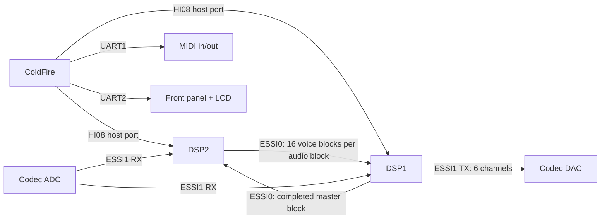
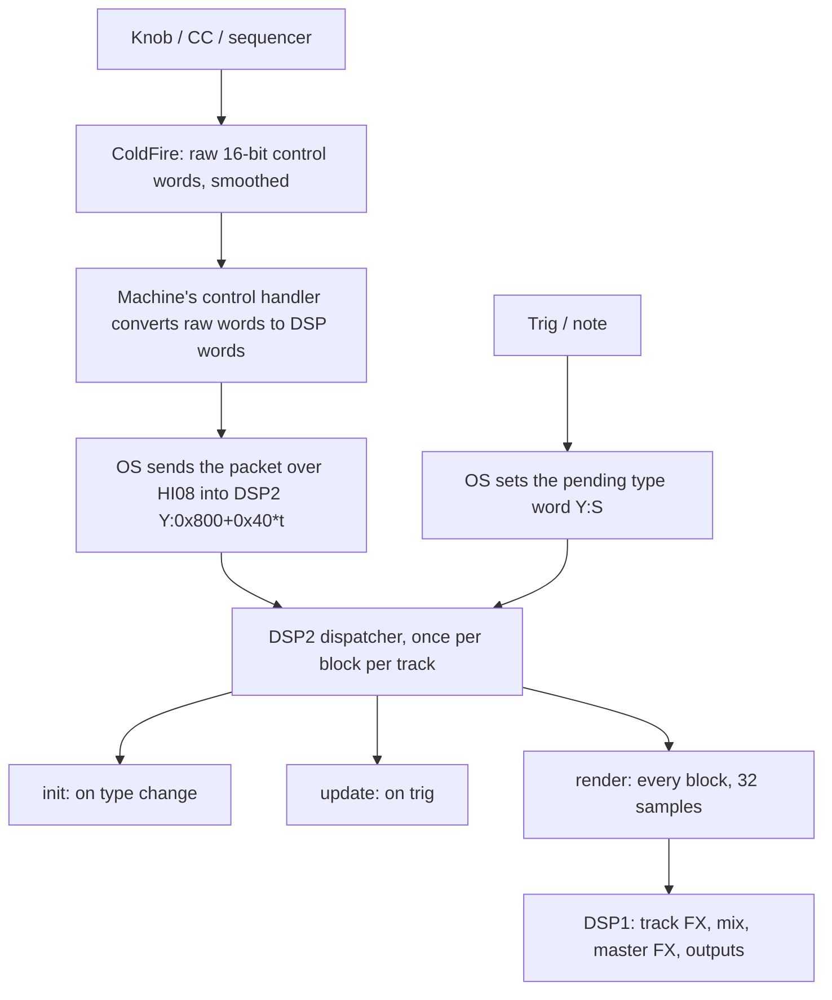

# System overview

## Processors

| Part | Role |
| --- | --- |
| **ColdFire MCF5206E** (CPU) | Runs the OS: UI, sequencer, MIDI, kits, parameter conversion, flash, DSP control. Older notes call it an MCF5307; both the board model and the MAME driver identify an MCF5206E. |
| **DSP56303 "DSP2"** (producer) | Renders the 16 machine voices, one 32-sample mono block per track per audio block. Holds the machine code, the stock sample data and the sample RAM. |
| **DSP56303 "DSP1"** (mixer) | Applies the per-track effects, mixes, runs the master delay, reverb, EQ and dynamics, and feeds the six-output codec. |

Both DSPs run the same kind of core but separate programs and separate memories.
Custom machines run on **DSP2**; DSP1 is untouched by all work in this kit.

## Links

- **HI08** (host interface): the ColdFire writes control data into DSP memory.
  The DSP-side handler receives a destination address and a word count, then DMA
  moves the words into Y memory (DSP2: host-command ISR at `P:0xE8`; DSP1 at
  `P:0x9AA`). This is how machine parameters reach a voice. The ColdFire can also
  read DSP memory back through handlers.
- **ESSI0** carries the voice blocks from DSP2 to DSP1 (DSP2 DMA0 → DSP1 DMA4) and
  the stereo master return from DSP1 back to DSP2 (used by RAM recording).
- **ESSI1** is the codec: stereo ADC into both DSPs, six DAC channels out of DSP1.
- **UART1** is MIDI; **UART2** talks to the front-panel processor (buttons, knobs
  and LCD). The older idea that the ColdFire sends MIDI bytes to a DSP SCI port to
  play voices is wrong: control goes through HI08.

## Audio timing

| Quantity | Value |
| --- | --- |
| Sample rate | 44,100 Hz |
| Block | 32 samples (0.726 ms) |
| DSP clock (board model) | 101,606,400 Hz = 2,304 cycles per sample |
| **Cycles per block, per DSP** | **73,728** |

Each audio block, DSP2 runs its **producer pass**: 16 voice calls, each writing
32 samples. Each finished block is DMA'd to DSP1 while the next voice renders.
DSP1 starts processing arriving voice blocks while DSP2 is still producing later
ones. Both DSPs must finish within their own 73,728-cycle budget. The two
budgets cannot be pooled.

A block missed on either side causes an audible glitch: a repeated old DAC half
or a stale voice. A severe DSP2 overrun on hardware first crackled, then lit
all front-panel LEDs and left the sound engine silent.

## Who does what for a machine

A machine therefore consists of:

1. **A ColdFire descriptor** (86 bytes): name, parameter labels, defaults and a
   pointer to its control handler.
2. **A ColdFire control handler**: converts the eight raw knob values into the
   words the DSP code wants.
3. **DSP2 code** with three entry points (init, update, render), found through
   three dispatch tables indexed by DSP type.
4. **Menu registration**: the descriptor must appear in a family list for the
   front panel to offer it.

The [machine catalogue](07-machine-catalogue.md) covers parts 1, 2 and 4, and the
[DSP2 voice ABI](08-dsp2-voice-abi.md) covers part 3.
